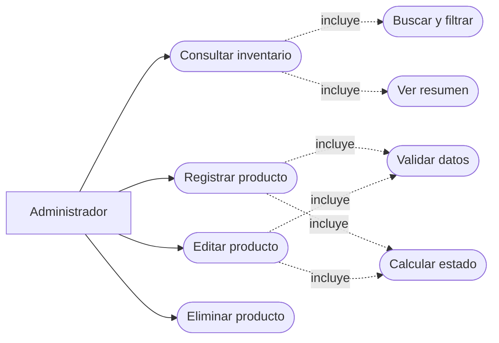
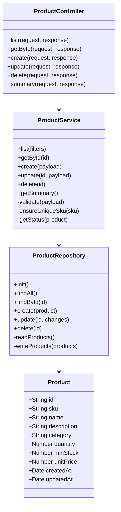
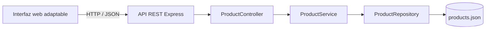

# Informe técnico del módulo de inventario

## 1. Identificación

- **Evidencia:** GA7-220501096-AA3-EV01
- **Aprendiz:** Andres Avendaño Lopez
- **Ficha:** 3235904
- **Tipo de proyecto:** aplicación web adaptable
- **Módulo codificado:** gestión de productos e inventario
- **Nombre del sistema:** StockFlow

## 2. Selección y alcance

Al no disponerse de artefactos previos dentro de la carpeta de trabajo, se estableció como caso de estudio un sistema web para controlar el inventario de una pequeña empresa. El incremento entregado cubre el ciclo completo de administración de productos: registrar, listar, buscar, filtrar, editar y eliminar. También calcula alertas de inventario y el valor estimado de las existencias.

Quedan fuera de este incremento la autenticación, la gestión de proveedores, los movimientos de entrada/salida y los reportes históricos. Esos elementos se muestran como ampliaciones futuras y no condicionan el funcionamiento del módulo entregado.

## 3. Historias de usuario

### HU-01. Consultar inventario

**Como** administrador, **quiero** consultar los productos y sus existencias, **para** conocer la disponibilidad actual.

Criterios de aceptación:

1. La lista muestra nombre, SKU, categoría, cantidad, precio y estado.
2. La consulta permite buscar por nombre o SKU.
3. La consulta permite filtrar por categoría y estado.
4. El sistema informa cuando no existen coincidencias.

### HU-02. Registrar producto

**Como** administrador, **quiero** registrar un producto, **para** incorporarlo al inventario.

Criterios de aceptación:

1. SKU, nombre, categoría, precio, cantidad e inventario mínimo son obligatorios.
2. El SKU debe ser único.
3. No se permiten cantidades ni precios negativos.
4. Al guardar, el producto aparece en la lista y el resumen se actualiza.

### HU-03. Actualizar producto

**Como** administrador, **quiero** modificar los datos y existencias de un producto, **para** mantener información confiable.

Criterios de aceptación:

1. El formulario carga la información vigente.
2. Se aplican las mismas validaciones del registro.
3. La fecha de actualización cambia al guardar.
4. El estado se calcula automáticamente: disponible, stock bajo o agotado.

### HU-04. Eliminar producto

**Como** administrador, **quiero** eliminar una referencia que ya no se maneja, **para** evitar registros obsoletos.

Criterios de aceptación:

1. El sistema solicita confirmación.
2. La eliminación actualiza el listado y el resumen.
3. Una referencia inexistente produce una respuesta controlada.

## 4. Casos de uso

## 5. Diagrama de clases

## 6. Arquitectura

La solución aplica una arquitectura por capas:

1. **Presentación:** HTML semántico, CSS adaptable y JavaScript del navegador.
2. **Rutas/controladores:** reciben solicitudes REST y producen respuestas HTTP uniformes.
3. **Servicios:** concentran validaciones, unicidad del SKU y cálculo de estados/resumen.
4. **Repositorio:** encapsula la lectura y escritura de datos en JSON.
5. **Persistencia:** archivo local `data/products.json` adecuado para el alcance académico.

Esta separación permite sustituir el JSON por PostgreSQL, MySQL o MongoDB sin trasladar reglas de negocio al controlador.

## 7. Tecnologías seleccionadas

| Tecnología | Uso | Justificación |
|---|---|---|
| Node.js 20 o superior | Entorno de ejecución | Permite usar JavaScript en servidor y cliente. |
| Express 5 | Framework web | Simplifica rutas, middleware, archivos estáticos y API REST. |
| HTML5 y CSS3 | Interfaz | Proporcionan semántica, accesibilidad y diseño adaptable sin dependencias visuales. |
| JavaScript ES2022 | Interacción | Consume la API y actualiza la interfaz sin recargar la página. |
| JSON | Persistencia académica | Facilita ejecución local y revisión de la evidencia. |
| Node Test Runner | Pruebas | Verifica reglas de negocio sin herramientas adicionales. |
| ESLint | Calidad | Comprueba reglas consistentes de codificación. |
| Git | Versionamiento | Registra la evolución y permite publicación en un repositorio remoto. |

## 8. Contrato de API

| Método | Ruta | Propósito | Respuesta esperada |
|---|---|---|---|
| GET | `/api/health` | Comprobar disponibilidad | 200 |
| GET | `/api/products` | Listar y filtrar productos | 200 |
| GET | `/api/products/summary` | Consultar indicadores | 200 |
| GET | `/api/products/:id` | Consultar un producto | 200 / 404 |
| POST | `/api/products` | Crear un producto | 201 / 409 / 422 |
| PUT | `/api/products/:id` | Actualizar un producto | 200 / 404 / 409 / 422 |
| DELETE | `/api/products/:id` | Eliminar un producto | 204 / 404 |

Parámetros opcionales de la consulta de productos:

- `q`: coincidencia parcial por SKU, nombre o categoría.
- `category`: categoría exacta.
- `status`: `available`, `low` u `out`.

## 9. Reglas de negocio

- El SKU se normaliza a mayúsculas, admite letras, números y guiones, y debe ser único.
- Nombre y categoría tienen una longitud mínima de tres caracteres.
- Cantidad e inventario mínimo son números enteros no negativos.
- El precio unitario es un número no negativo.
- Un producto con cantidad cero está **agotado**.
- Un producto con cantidad mayor que cero y menor o igual al inventario mínimo tiene **stock bajo**.
- Los demás productos se consideran **disponibles**.
- Las mutaciones se serializan y se escriben primero en un archivo temporal para reducir el riesgo de corrupción de datos.

## 10. Diseño y accesibilidad

La interfaz sigue un patrón de tablero administrativo, con navegación lateral, indicadores, filtros y tabla. En pantallas pequeñas la tabla se transforma en tarjetas verticales y el formulario usa una sola columna. Se incorporan etiquetas de formulario, regiones de estado, texto alternativo para acciones, foco visible y contraste suficiente.

## 11. Plan de construcción aplicado

| Fase | Actividad | Resultado |
|---|---|---|
| Análisis | Delimitar alcance e historias de usuario | Cuatro historias y reglas verificables |
| Diseño | Definir capas, clases, API y prototipo | Diagramas y contrato técnico |
| Construcción | Implementar API, persistencia e interfaz | Módulo CRUD adaptable |
| Verificación | Ejecutar pruebas y análisis estático | Pruebas automatizadas y ESLint |
| Entrega | Documentar, versionar y comprimir | Carpeta y ZIP de evidencia |

## 12. Matriz de pruebas

| Caso | Entrada/acción | Resultado esperado |
|---|---|---|
| Crear válido | Datos completos y SKU nuevo | Producto creado, estado disponible |
| SKU duplicado | SKU ya registrado | Error 409 |
| Datos inválidos | Nombre vacío o cantidad negativa | Error 422 con detalles |
| Cambiar existencias | Cantidad igual al mínimo | Estado stock bajo |
| Resumen | Productos disponibles y agotados | Totales y valor correctos |
| Eliminar | Identificador existente | Producto retirado |
| Buscar | Texto parcial de nombre o SKU | Solo coincidencias |
| Adaptabilidad | Ancho menor a 760 px | Tabla convertida en tarjetas |

## 13. Estándares de codificación

- Sangría de dos espacios y final de línea LF mediante `.editorconfig`.
- Nombres de clases en `PascalCase`, variables y funciones en `camelCase`.
- Responsabilidad única por capa.
- Uso de `const`/`let`, igualdad estricta y bloques obligatorios.
- Comentarios JSDoc y comentarios breves en decisiones no evidentes.
- Errores de negocio centralizados y respuestas JSON uniformes.
- Validación tanto en cliente como en servidor.

## 14. Versionamiento

El proyecto se inicializa como repositorio Git. Los archivos temporales, dependencias y secretos se excluyen mediante `.gitignore`. El historial puede publicarse en GitHub, GitLab o Bitbucket y la URL final debe registrarse en `ENLACE_REPOSITORIO.txt` antes de enviar la evidencia.
